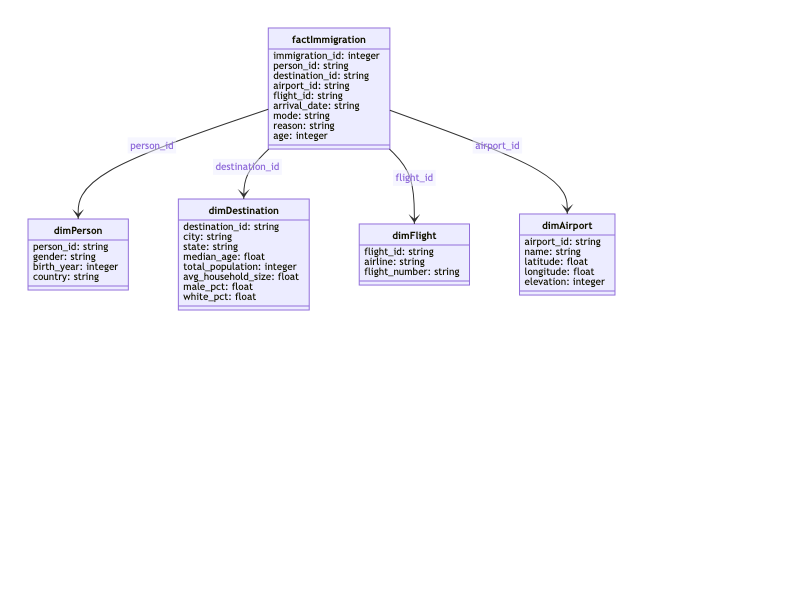

# Data pipeline US immigration and socio-demographic data

This is my take on the [Udacity Data Engineering](https://www.udacity.com/course/data-engineer-nanodegree--nd027) Capstone Project.
The project uses the following data sets:

- I94 Immigration Data
- U.S. City Demographic Data
- Airport Code Table

The solution uses pyspark and airflow to transform the input files
into a database schema which is suitable for analytics purposes.



The goal of the target schema is to provide government agencies with
an easy to use database schema for doing analysis on which people and how many are coming to
the US, when are they coming, from which country, by which mode of travel and to which destinations and what is their purpose.

Please read [details in this jupyter notebook] (file://./immigration.ipynb)

## Running the data pipeline

To run the data pipeline you can use a local installation of airflow (for installation see below)
and a spark cluster on amazon emr. Alternatively you can of course also use a managed version
of airflow (see https://docs.aws.amazon.com/mwaa/latest/userguide/get-started.html).

Follow these steps:

- put input files located in (file://./sample_data) in an amazon s3 bucket and change the s3 urls used in the code accordingly
- start a spark cluster on emr
- enable incoming ssh traffic to the master node
- copy the master nodes host name to the clipboard in the amazon web console
- start apache airflow locally
- create an ssh connection named "ssh_emr" (see also https://docs.aws.amazon.com/mwaa/latest/userguide/samples-ssh.html)
- start the immigration dag job
- after a successful run the pipeline should put the output as parquet files in your s3 bucket

## Development

For development purposes you might want to start local instances of
spark and/or airflow.

## Run pyspark in jupyter notebook

Start pyspark in a docker container from the root directory.

```bash
docker run -p 8888:8888 -v $(pwd):/home/jovyan/data jupyter/pyspark-notebook
```

Then open (file://./immigration.ipynb) in jupyter lab.

## Run data pipelines in airflow

Follow airflow docs to install airflow locally using pip.

```bash
AIRFLOW_HOME=$(pwd) airflow standalone
```

Then open airflow in the browser. Airflow should now pickup
any changes in **immigration_dag.py**

## Ideas for improvement

- Use pytest to test data cleaning methods and udfs
- Make s3 url configurable
