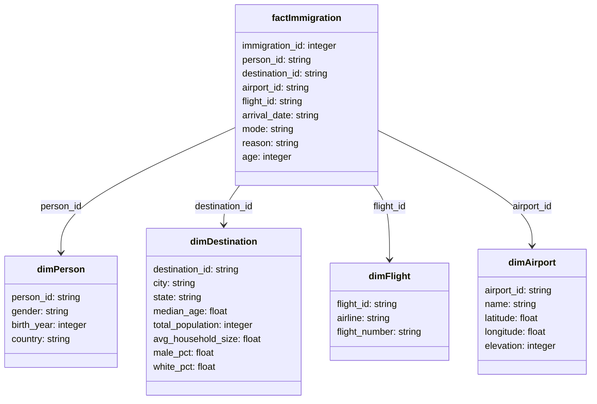

```mermaid
   classDiagram

   factImmigration --> dimPerson: person_id
   factImmigration --> dimDestination: destination_id
   factImmigration --> dimFlight: flight_id
   factImmigration --> dimAirport: airport_id

   class factImmigration {
           immigration_id: integer
           person_id: string
           destination_id: string
           airport_id: string
           flight_id: string
           arrival_date: string
           mode: string
           reason: string
           age: integer
   }
   class dimPerson {
           person_id: string
           gender: string
           birth_year: integer
           country: string
   }
   class dimDestination {
           destination_id: string
           city: string
           state: string
           median_age: float
           total_population: integer
           avg_household_size: float
           male_pct: float
           white_pct: float
   }
   class dimFlight {
           flight_id: string
           airline: string
           flight_number: string
   }
   class dimAirport {
           airport_id: string
           name: string
           latitude: float
           longitude: float
           elevation: integer
   }
```
